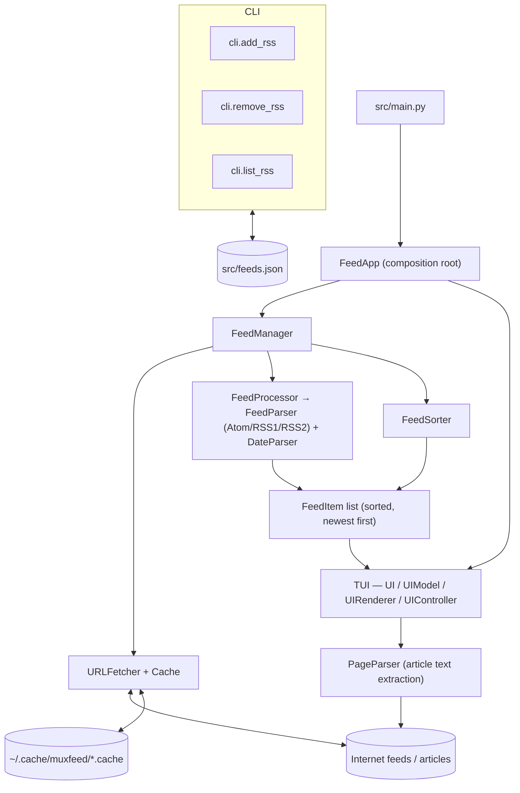
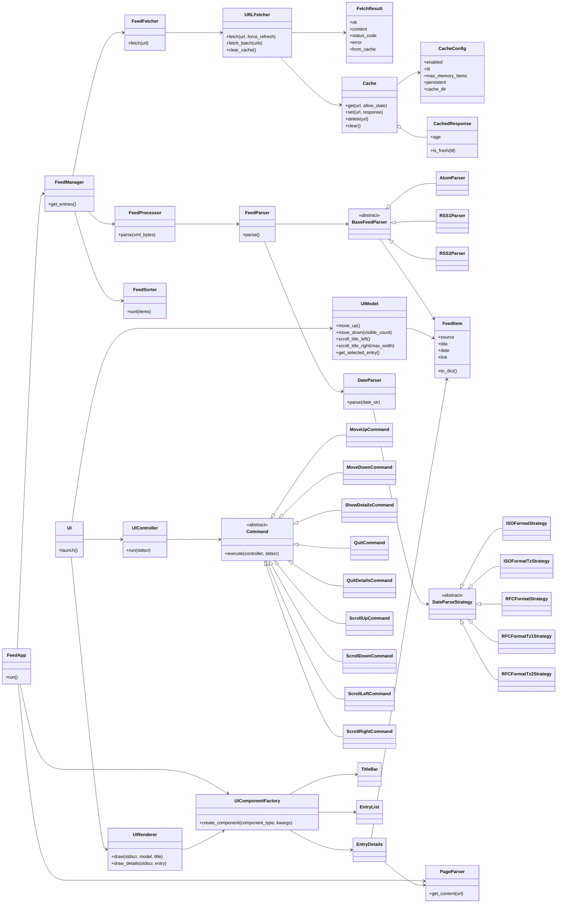
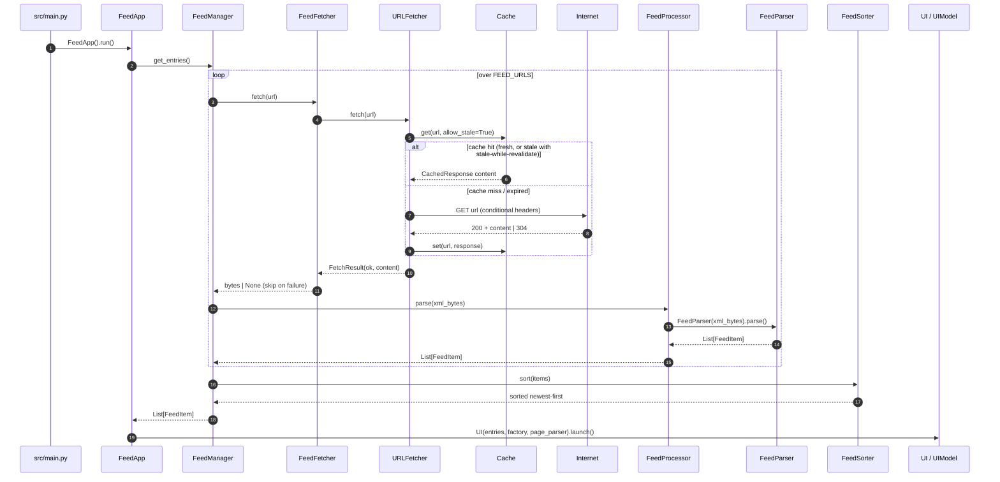
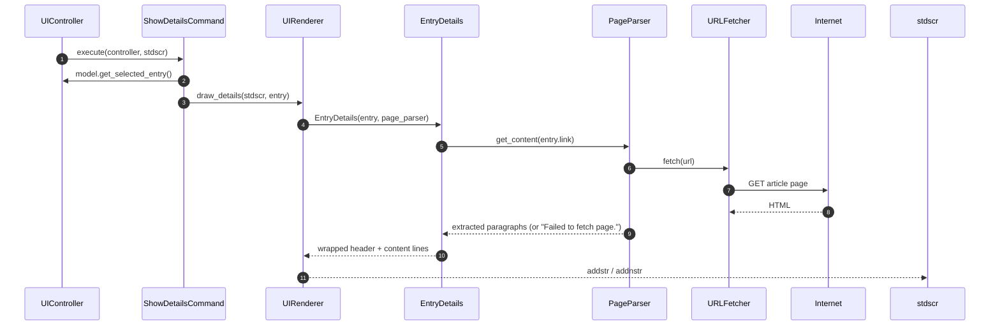

# muxfeed — Architecture

This document visualizes the current muxfeed architecture. All diagrams are
[Mermaid](https://mermaid.js.org/) and render on GitHub.

Four layers:

1. **Fetchers** — `URLFetcher` (retry/backoff, conditional GET) backed by a two-tier `Cache` (memory + JSON on disk)
2. **Parsers** — `FeedParser` dispatching to Atom / RSS1 / RSS2 parsers, a strategy-based `DateParser`, and a `PageParser` (BeautifulSoup article extraction)
3. **Application** — `FeedFetcher → FeedProcessor → FeedSorter → FeedManager`
4. **TUI** — curses MVC: `UIModel` (state), `UIRenderer` + components (view), `UIController` + commands (Command pattern), `UIComponentFactory` (Factory)

---

## 1. System Overview

Notes on the current wiring:

- `FEED_URLS` is read from `src/feeds.json` **once at import** in `src/config.py` — CLI changes only take effect after a restart.
- `src/feeds.json` is gitignored (user-local subscription list).
- Overall the app touches the network only for subscribed feeds and opened articles — no telemetry, no accounts.

---

## 2. Class Diagram

Known annotation mismatches that are intentional in the code today (see
`docs/feature_status.md` and `docs/arch_decision_records.md`):

- `FeedManager.parser` is annotated `FeedParser` but receives a `FeedProcessor` (works by duck typing — issue **A2**).
- `FeedItem.date` is annotated `Optional[datetime]` but holds a display string (see **ADR-001**, issue **A1**).
- `NS` maps RSS 1.0 under `rss1`; real RDF feeds use `rdf` (issue **A3**).

---

## 3. Startup Data Flow (fetch → parse → sort → display)

---

## 4. Article View Flow (fetch-on-open)

> **Note:** the article fetch in step 8 happens **inside the draw path** and
> blocks the TUI until the page loads — this is **ADR-002**'s "fetch-on-open"
> problem (issue **A4**). Scrolling the article view is handled by
> `ScrollDownCommand` / `ScrollUpCommand` operating on `EntryDetails.start_line`.

---

## 5. Related Documents

- `docs/feature_status.md` — feature list, open issues (A1–C2), roadmap, sprint plan
- `docs/arch_decision_records.md` — **ADR-001** (canonical date representation), **ADR-002** (fetch-on-open article loading)
- `docs/code_review.md` — full code review findings
- `docs/test_automation.md` — testing standards and patterns
- `CHANGELOG.md` — release history