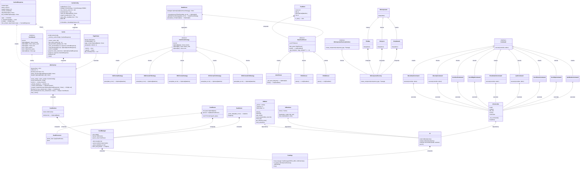

```mermaid
classDiagram
    direction TB
    %% src/app
    class FeedApp
        FeedApp: + feed_manager FeedManager(FEED_URLS, URLFetcher())
        FeedApp: + ui_factory UIComponentFactory()
        FeedApp: - _getEntries()
        FeedApp: + run()
    class FeedFetcher
        FeedFetcher: fetcher URLFetcher
        FeedFetcher: fetch(url str) -> Optional[bytes]
    class FeedProcessor
        FeedProcessor: parser_class Type[FeedParser] 
        FeedProcessor: parse
    class FeedSorter
        FeedSorter: _parse_date(date_str str) -> datetime
        FeedSorter: sort(items)
    class FeedManager
        FeedManager: + urls List[str]
        FeedManager: + fetcher URLFetcher
        FeedManager: + parser_class FeedParser
        FeedManager: - _fetch_feed(url str)
        FeedManager: - _parse_feed(xml_bytes bytes)
        FeedManager: - _parse_date(date_str str)
        FeedManager: + fetch_and_parse() -> List[Dict]
        
    %% src/fetchers
    class CachedResponse
        CachedResponse: content bytes
        CachedResponse: status_code int
        CachedResponse: headers Dict[str, str]
        CachedResponse: cached_at datetime
        CachedResponse: etag Optional[str] = None
        CachedResponse: last_modified Optional[str] = None
        CachedResponse: age() -> timedelta
        CachedResponse: is_fresh(ttl timedelta) -> bool
        CachedResponse: to_dict() -> Dict[str, Any]
        CachedResponse: from_dict(cls, data Dict[str, Any]) -> 'CachedResponse'
    class CacheConfig
        CacheConfig: enabled bool = True
        CacheConfig: strategy CacheStrategy = CacheStrategy.HYBRID
        CacheConfig: ttl timedelta = timedelta(minutes=15)
        CacheConfig: max_memory_items int = 100
        CacheConfig: persistent bool = True
        CacheConfig: cache_dir Optional[Path] = None
        CacheConfig: respect_headers bool = True
        CacheConfig: stale_while_revalidate bool = True
        CacheConfig: __post_init__
    class Cache
        Cache: - config CacheConfig
        Cache: - _memory_cache Dict[str, CachedResponse]
        Cache: - _ensure_cache_dir()
        Cache: - _get_cache_key(url str) str
        Cache: - _get_persistent_path(key str) Path
        Cache: - _save_persistent(key str, response CachedResponse)
        Cache: - _load_persistent(key str) Optional[CachedResponse]
        Cache: - _evict_if_needed()
        Cache: + get(url str, allow_stale bool) Optional[CachedResponse]
        Cache: + set(url str, response CachedResponse)
        Cache: + delete(url str)
        Cache: + clear()
    class FetchResult
        <<interface>> FetchResult
            FetchResult: bool ok
            FetchResult: Optional[bytes] = None content
            FetchResult: Optional[int] = None status_code
            FetchResult: Optional[str] = None error
            FetchResult: bool = False cached
            FetchResult: bool = False from_cache
            FetchResult: Optional[float] = None age
    class URLFetcher
        URLFetcher: timeout float = 10.0,
        URLFetcher: retries int = 3,
        URLFetcher: backoff_factor float = 0.5,
        URLFetcher: status_forcelist Optional[Sequence[int]] = None,
        URLFetcher: headers Optional[Dict[str, str]] = None,
        URLFetcher: cache_config = cache_config or CacheConfig()
        URLFetcher: cache Cache(cache_config)
        URLFetcher: session -> _create_session()
        URLFetcher: _default_headers() -> Dict[str, str]
        URLFetcher: _create_session(self) -> requests.Session
        URLFetcher: _prepare_headers(cached Optional[CachedResponse] = None) -> Dict[str, str]
        URLFetcher: fetch(url str, force_refresh bool = False) -> FetchResult
        URLFetcher: fetch_batch(urls list, force_refresh bool = False) -> Dict[str, FetchResult]
        URLFetcher: clear_cache()
        
    %% src/parsers
    class DateParseStrategy
        <<Abstract>> DateParseStrategy
            DateParseStrategy: bool ok
            DateParseStrategy: Optional[bytes] = None content
            DateParseStrategy: Optional[int] = None status_code
            DateParseStrategy: Optional[str] = None error
    class ISOFormatStrategy
        ISOFormatStrategy: parse(date_str str) -> Optional[datetime]
    class ISOFormatTzStrategy
        ISOFormatTzStrategy: parse(date_str str) -> Optional[datetime]
    class RFCFormatStrategy
        RFCFormatStrategy: parse(date_str str) -> Optional[datetime]
    class RFCFormatTz1Strategy
        RFCFormatTz1Strategy: parse(date_str str) -> Optional[datetime]
    class RFCFormatTz2Strategy
        RFCFormatTz2Strategy: parse(date_str str) -> Optional[datetime]
    class DateParser
        DateParser: strategies Optional[List[DateParseStrategy]] = None
        DateParser: _convertIntoLocalTimeZone(date_str str) -> Optional[str]
        DateParser: _getDateParseStrategy(date_str str) -> DateParseStrategy
        DateParser: parse(date_str Optional[str]) -> Optional[str]
    
    class FeedItem
        FeedItem: source str
        FeedItem: title str
        FeedItem: date Optional[datetime]
        FeedItem: link str
        FeedItem: to_dict() -> Dict
    
    class BaseFeedParser
        <<Abstract>> BaseFeedParser
            BaseFeedParser: root ET.Element
            BaseFeedParser: date_parser DateParser()
        BaseFeedParser: parse() -> List[FeedItem]
        BaseFeedParser: _get_text(elem, *tags, default="") -> str
    class AtomParser
        AtomParser: _get_atom_link(entry) -> Optional[str]
        AtomParser: parse() -> List[FeedItem]
    class RSS1Parser
        RSS1Parser: parse() -> List[FeedItem]
    class RSS2Parser
        RSS2Parser: parse() -> List[FeedItem]
    class FeedParser
        FeedParser: xml_bytes Optional[bytes]
        FeedParser: root ET.fromstring(xml_bytes)
        FeedParser: parsers = List[BaseFeedParser]
    
    class PageParser
        PageParser: fetcher URLFetcher
        PageParser: url Optional[str] = url
        PageParser: page_content Optional[bytes] = None
        PageParser: paragraphs List[str] = []
        PageParser: _fetch() -> bool
        PageParser: _parse() -> None
        PageParser: get_content(url str) -> str
        
    %% src/tui
    class UI
        UI: model UIModel(entries)
        UI: renderer UIRenderer(factory)
        UI: controller UIController(model, renderer)
        UI: launch()
        
    class UIComponentFactoryInterface   
        <<Interface>> UIComponentFactoryInterface
            UIComponentFactoryInterface: create_component(component_type, **kwargs)
    class UIComponentFactory
        UIComponentFactory: create_component(component_type, **kwargs)
    
    class UIComponent
        UIComponent: draw(stdscr)
    class TitleBar
        TitleBar: draw(stdscr)
    class EntryList
        EntryList: draw(stdscr)
    class EntryDetails
        EntryDetails: draw(stdscr)
        
    class UIController
        UIController: model
        UIController: renderer
        UIController: title_text
        UIController: running
        UIController: commands
        UIController: _init_commands()
        UIController: run(stdscr)
        
    class Command   
        <<Interface>> Command
            Command: execute(controller, stdscr)
    class MoveDownCommand
        MoveDownCommand: execute(controller, stdscr)
    class MoveUpCommand
        MoveUpCommand: execute(controller, stdscr)
    class ShowDetailsCommand
        ShowDetailsCommand: execute(controller, stdscr)
    class QuitCommand
        QuitCommand: execute(controller, stdscr)
        
    class UIModel
        UIModel: _entries = entries
        UIModel: _selected = 0
        UIModel: _start_index = 0
        UIModel: entries()
        UIModel: selected()
        UIModel: start_index()
        UIModel: move_down(visible_count int)
        UIModel: move_up()
        UIModel: get_selected_entry()
        UIModel: reset_selection()
    
    class UIRenderer
        UIRenderer: factory = factory
        UIRenderer: draw(stdscr, model, title_text)
        UIRenderer: draw_details(stdscr, entry)
    
    %% #######
    %% FETCHERS
    %% #######
    
    CachedResponse <.. URLFetcher : inherits
    CachedResponse <.. Cache : inherits
    FetchResult <.. URLFetcher : inherits
    CacheConfig *-- Cache : composite
    Cache       *-- URLFetcher : composite

    %% #######
    %% PARSERS
    %% #######

    DateParseStrategy <|-- ISOFormatStrategy : inherits
    DateParseStrategy <|-- ISOFormatTzStrategy : inherits
    DateParseStrategy <|-- RFCFormatStrategy : inherits
    DateParseStrategy <|-- RFCFormatTz1Strategy : inherits
    DateParseStrategy <|-- RFCFormatTz2Strategy : inherits

    DateParser --o DateParseStrategy : aggregates

    BaseFeedParser <|-- AtomParser : inherits
    BaseFeedParser <|-- RSS1Parser : inherits
    BaseFeedParser <|-- RSS2Parser : inherits
    FeedItem *-- BaseFeedParser : composite
    DateParser <-- BaseFeedParser

    PageParser --> URLFetcher : associate

    %% #######
    %% TUI
    %% #######

    UIComponentFactoryInterface <|-- UIComponentFactory : inherits
    TitleBar      *-- UIComponentFactory : composite
    EntryList     *-- UIComponentFactory : composite
    EntryDetails  *-- UIComponentFactory : composite

    UIComponent <|-- TitleBar : inherits
    UIComponent <|-- EntryList : inherits
    UIComponent <|-- EntryDetails : inherits

    Command <|-- MoveDownCommand : inherits
    Command <|-- MoveUpCommand : inherits
    Command <|-- ScrollLeftCommand : inherits
    Command <|-- ScrollRightCommand : inherits
    Command <|-- ShowDetailsCommand : inherits
    Command <|-- QuitCommand : inherits
    Command <|-- ScrollDownCommand : inherits
    Command <|-- ScrollUpCommand : inherits
    Command <|-- QuitDetailsCommand : inherits
    MoveDownCommand <-- UIController : associate
    MoveUpCommand <-- UIController : associate
    ScrollLeftCommand <-- UIController : associate
    ScrollRightCommand <-- UIController : associate
    ShowDetailsCommand <-- UIController : associate
    QuitCommand <-- UIController : associate
    ScrollDownCommand <-- UIController : associate
    ScrollUpCommand <-- UIController : associate
    QuitDetailsCommand <-- UIController : associate
    UIModel <-- UI : dependency
    UIRenderer <-- UI : dependency
    UIController <-- UI : dependency

    %% #######
    %% APP
    %% #######

    URLFetcher *-- FeedFetcher : composite
    FeedParser *-- FeedProcessor : composite
    FeedFetcher *-- FeedManager : composite
    FeedParser *-- FeedManager : composite
    FeedSorter *-- FeedManager : composite

    FeedManager *-- FeedApp : composite
    UI *-- FeedApp : composite
```