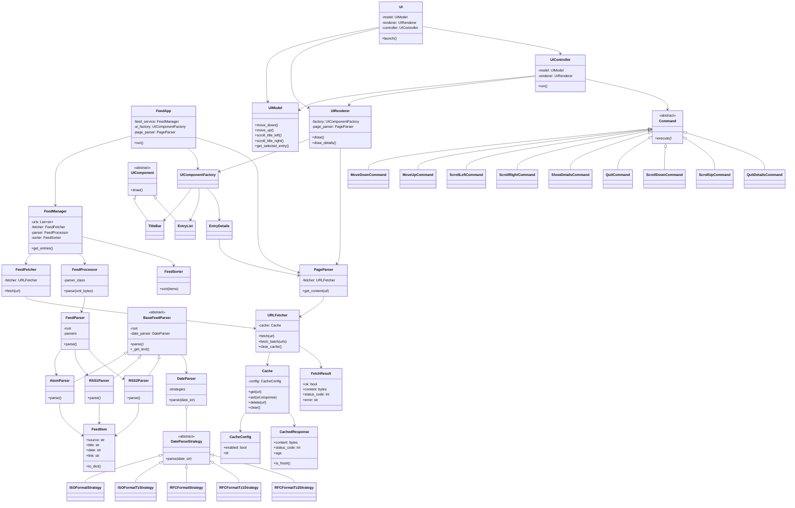

```mermaid
classDiagram

%% =========================
%% Application Layer
%% =========================

class FeedApp {
    -feed_service: FeedManager
    -ui_factory: UIComponentFactory
    -page_parser: PageParser
    +run()
}

class FeedManager {
    -urls: List~str~
    -fetcher: FeedFetcher
    -parser: FeedProcessor
    -sorter: FeedSorter
    +get_entries()
}

class FeedFetcher {
    -fetcher: URLFetcher
    +fetch(url)
}

class FeedProcessor {
    -parser_class
    +parse(xml_bytes)
}

class FeedSorter {
    +sort(items)
}

FeedApp --> FeedManager
FeedApp --> UIComponentFactory
FeedApp --> PageParser

FeedManager --> FeedFetcher
FeedManager --> FeedProcessor
FeedManager --> FeedSorter


%% =========================
%% Feed Parsing
%% =========================

class FeedParser {
    -root
    -parsers
    +parse()
}

class FeedItem {
    +source: str
    +title: str
    +date: str
    +link: str
    +to_dict()
}

class BaseFeedParser {
    <<abstract>>
    -root
    -date_parser: DateParser
    +parse()*
    +_get_text()
}

class AtomParser {
    +parse()
}

class RSS1Parser {
    +parse()
}

class RSS2Parser {
    +parse()
}

FeedProcessor --> FeedParser
FeedParser --> AtomParser
FeedParser --> RSS1Parser
FeedParser --> RSS2Parser

BaseFeedParser <|-- AtomParser
BaseFeedParser <|-- RSS1Parser
BaseFeedParser <|-- RSS2Parser

AtomParser --> FeedItem
RSS1Parser --> FeedItem
RSS2Parser --> FeedItem


%% =========================
%% Date Parsing Strategy
%% =========================

class DateParser {
    -strategies
    +parse(date_str)
}

class DateParseStrategy {
    <<abstract>>
    +parse(date_str)*
}

class ISOFormatStrategy
class ISOFormatTzStrategy
class RFCFormatStrategy
class RFCFormatTz1Strategy
class RFCFormatTz2Strategy

DateParseStrategy <|-- ISOFormatStrategy
DateParseStrategy <|-- ISOFormatTzStrategy
DateParseStrategy <|-- RFCFormatStrategy
DateParseStrategy <|-- RFCFormatTz1Strategy
DateParseStrategy <|-- RFCFormatTz2Strategy

DateParser o-- DateParseStrategy
BaseFeedParser --> DateParser


%% =========================
%% Fetching & Cache
%% =========================

class URLFetcher {
    -cache: Cache
    +fetch(url)
    +fetch_batch(urls)
    +clear_cache()
}

class FetchResult {
    +ok: bool
    +content: bytes
    +status_code: int
    +error: str
}

class Cache {
    -config: CacheConfig
    +get(url)
    +set(url,response)
    +delete(url)
    +clear()
}

class CacheConfig {
    +enabled: bool
    +ttl
}

class CachedResponse {
    +content: bytes
    +status_code: int
    +age
    +is_fresh()
}

URLFetcher --> Cache
URLFetcher --> FetchResult

Cache --> CacheConfig
Cache --> CachedResponse

FeedFetcher --> URLFetcher


%% =========================
%% Page Parsing
%% =========================

class PageParser {
    -fetcher: URLFetcher
    +get_content(url)
}

PageParser --> URLFetcher


%% =========================
%% UI Layer
%% =========================

class UI {
    -model: UIModel
    -renderer: UIRenderer
    -controller: UIController
    +launch()
}

class UIModel {
    +move_down()
    +move_up()
    +scroll_title_left()
    +scroll_title_right()
    +get_selected_entry()
}

class UIRenderer {
    -factory: UIComponentFactory
    -page_parser: PageParser
    +draw()
    +draw_details()
}

class UIController {
    -model: UIModel
    -renderer: UIRenderer
    +run()
}

UI --> UIModel
UI --> UIRenderer
UI --> UIController

UIRenderer --> UIComponentFactory
UIRenderer --> PageParser

UIController --> UIModel
UIController --> UIRenderer


%% =========================
%% UI Components
%% =========================

class UIComponent {
    <<abstract>>
    +draw()
}

class TitleBar
class EntryList
class EntryDetails

UIComponent <|-- TitleBar
UIComponent <|-- EntryList

UIComponentFactory --> TitleBar
UIComponentFactory --> EntryList
UIComponentFactory --> EntryDetails

EntryDetails --> PageParser


%% =========================
%% Command Pattern
%% =========================

class Command {
    <<abstract>>
    +execute()*
}

class MoveDownCommand
class MoveUpCommand
class ScrollLeftCommand
class ScrollRightCommand
class ShowDetailsCommand
class QuitCommand
class ScrollDownCommand
class ScrollUpCommand
class QuitDetailsCommand

Command <|-- MoveDownCommand
Command <|-- MoveUpCommand
Command <|-- ScrollLeftCommand
Command <|-- ScrollRightCommand
Command <|-- ShowDetailsCommand
Command <|-- QuitCommand
Command <|-- ScrollDownCommand
Command <|-- ScrollUpCommand
Command <|-- QuitDetailsCommand

UIController --> Command
```