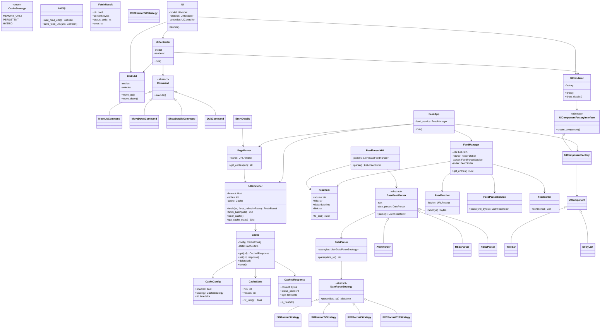

```mermaid
classDiagram

%% =========================
%% CONFIG
%% =========================
class CacheStrategy {
  <<enum>>
  MEMORY_ONLY
  PERSISTENT
  HYBRID
}

class config {
  +load_feed_urls() List~str~
  +save_feed_urls(urls: List~str~)
}

%% =========================
%% FETCHER + CACHE
%% =========================
class URLFetcher {
  -timeout: float
  -retries: int
  -cache: Cache
  +fetch(url, force_refresh=False) FetchResult
  +fetch_batch(urls) Dict
  +clear_cache()
  +get_cache_stats() Dict
}

class FetchResult {
  +ok: bool
  +content: bytes
  +status_code: int
  +error: str
}

class Cache {
  -config: CacheConfig
  -stats: CacheStats
  +get(url) CachedResponse
  +set(url, response)
  +delete(url)
  +clear()
}

class CacheConfig {
  +enabled: bool
  +strategy: CacheStrategy
  +ttl: timedelta
}

class CacheStats {
  +hits: int
  +misses: int
  +hit_rate(): float
}

class CachedResponse {
  +content: bytes
  +status_code: int
  +age: timedelta
  +is_fresh(ttl)
}

URLFetcher --> Cache
Cache --> CacheConfig
Cache --> CacheStats
Cache --> CachedResponse

%% =========================
%% PARSERS (DATE STRATEGY)
%% =========================
class DateParser {
  -strategies: List~DateParseStrategy~
  +parse(date_str) str
}

class DateParseStrategy {
  <<abstract>>
  +parse(date_str) datetime
}

class ISOFormatStrategy
class ISOFormatTzStrategy
class RFCFormatStrategy
class RFCFormatTz1Strategy
class RFCFormatTz2Strategy

DateParseStrategy <|-- ISOFormatStrategy
DateParseStrategy <|-- ISOFormatTzStrategy
DateParseStrategy <|-- RFCFormatStrategy
DateParseStrategy <|-- RFCFormatTz1Strategy
DateParser --> DateParseStrategy

%% =========================
%% FEED PARSER
%% =========================
class FeedItem {
  +source: str
  +title: str
  +date: datetime
  +link: str
  +to_dict() Dict
}

class BaseFeedParser {
  <<abstract>>
  -root
  -date_parser: DateParser
  +parse() List~FeedItem~
}

class AtomParser
class RSS1Parser
class RSS2Parser

BaseFeedParser <|-- AtomParser
BaseFeedParser <|-- RSS1Parser
BaseFeedParser <|-- RSS2Parser

class FeedParserXML {
  -parsers: List~BaseFeedParser~
  +parse() List~FeedItem~
}

FeedParserXML --> BaseFeedParser
BaseFeedParser --> DateParser
FeedParserXML --> FeedItem

%% =========================
%% PAGE PARSER
%% =========================
class PageParser {
  -fetcher: URLFetcher
  +get_content(url) str
}

PageParser --> URLFetcher

%% =========================
%% APP LAYER
%% =========================
class FeedFetcher {
  -fetcher: URLFetcher
  +fetch(url) bytes
}

class FeedParserService {
  +parse(xml_bytes) List~FeedItem~
}

class FeedSorter {
  +sort(items) List
}

class FeedManager {
  -urls: List~str~
  -fetcher: FeedFetcher
  -parser: FeedParserService
  -sorter: FeedSorter
  +get_entries() List
}

FeedManager --> FeedFetcher
FeedManager --> FeedParserService
FeedManager --> FeedSorter
FeedManager --> FeedItem

%% =========================
%% UI (MVC + COMMAND + FACTORY)
%% =========================
class UI {
  -model: UIModel
  -renderer: UIRenderer
  -controller: UIController
  +launch()
}

class UIModel {
  -entries
  -selected
  +move_up()
  +move_down()
}

class UIRenderer {
  -factory
  +draw()
  +draw_details()
}

class UIController {
  -model
  -renderer
  +run()
}

UI --> UIModel
UI --> UIRenderer
UI --> UIController

UIController --> UIModel
UIController --> UIRenderer

%% COMMAND PATTERN
class Command {
  <<abstract>>
  +execute()
}

class MoveUpCommand
class MoveDownCommand
class ShowDetailsCommand
class QuitCommand

Command <|-- MoveUpCommand
Command <|-- MoveDownCommand
Command <|-- ShowDetailsCommand
Command <|-- QuitCommand

UIController --> Command

%% FACTORY PATTERN
class UIComponentFactoryInterface {
  <<abstract>>
  +create_component()
}

class UIComponentFactory

class UIComponent
class TitleBar
class EntryList
class EntryDetails

UIComponentFactoryInterface <|-- UIComponentFactory
UIComponent <|-- TitleBar
UIComponent <|-- EntryList

UIComponentFactory --> UIComponent
UIRenderer --> UIComponentFactoryInterface
EntryDetails --> PageParser

%% =========================
%% APP ROOT
%% =========================
class FeedApp {
  -feed_service: FeedManager
  +run()
}

FeedApp --> FeedManager
FeedApp --> PageParser
FeedApp --> UIComponentFactory
FeedApp --> URLFetcher
```     